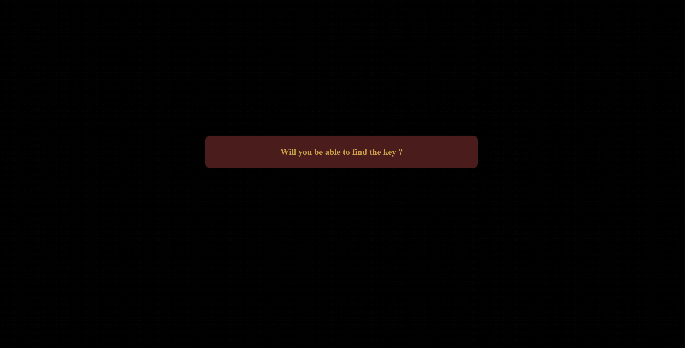

# Vendredi

## ARG

### Warning

Si vous comptez résoudre l'énigme, merci de n'ouvrir que le fichier index.html dans un serveur local 
Ce README a pour objectif d'expliquer l'ARG de A à Z, ne le lisez pas si vous avez l'intention de résoudre l'énigme.

### Index.html

Il s'agit de la page d'arrivée, en apparence, il n'y a rien dessus mais avec un
ctrl + a, on découvre le texte caché sur la page, celui-ci est un passage du film V pour Vendetta qui fait référence au projet de mardi, "qui a pour but de faire des V", indice quant à l'endroit où trouver la première pièce du puzzle.
les lettres en majuscules font ressortir le mot "page.html" qui est une page disponible sur le projet.

### Page.html ou page 2

C'est ici que les trois autres indices se trouvent.
Le premier, le plus facile à trouver, est au niveau du mot "key", il s'agit d'un lien vers la biographie d'un auteur de Haikus "Kobayashi Issa".
Le deuxième se trouve dans la console, il s'agit d'une paire de coordonnées (Qui correspondent aux Sechelles).
Et le troisième se trouve caché sur le fond noir de l'image, en prenant la page en capture d'écran et en jouant avec la luminosité, le mot "TEXTE" apparaît.

La dernière chose à trouver sur cette page fait référence à son <title>, page 2, il faut ici comprendre qu'une page 1 existe et se rendre dessus.

### Page1.html

Cette page sert à rentrer les codes obtenus relatifs aux quatres indices pour accéder à la nouvelle étape, rien de plus. Donnant à la fin accès à la page 3.

### ZXJ0eWxtbGtqaGdmY3Zibg.html ou page 3

La chasse n'est pas finie ! la page 3 demande un nouveau code à rentrer.
Il se trouve cette fois directement dans le dossier ARG, car on le trouve dans le .vscode
Et oui, le .vscode est un dossier créé à la main pour y cacher des choses.

### Ickwu Kwnkwu Ecguct.txt et text.txt

Il s'agit ici des dernières étapes du puzzle, le premier fichier n'est pas ouvrable car il s'agit en fait d'une image ! Il faut changer l'extention du fichier pour obtenir une image de Jules César, référence au code césar qui permet de crypter des textes.
Le nom du fichier est en fait le nom de Jules César crypté avec la même clé de chiffrement que le texte du text.txt. Une fois la clé trouvé et le texte décrypté, on y découvre un paragraphe qui nous est familier... 
Et on y trouve le dernier mot à trouver pour accéder à la page finale de ce jeux de pistes :)

### a2pmdmJuZG52c21sdmR3bA.html ou page 4

Il s'agit de la page de fin de l'énigme, sur laquelle vous trouverez le code final !

J'espère que vous aurez quand même pu avoir le temps d'essayer !
