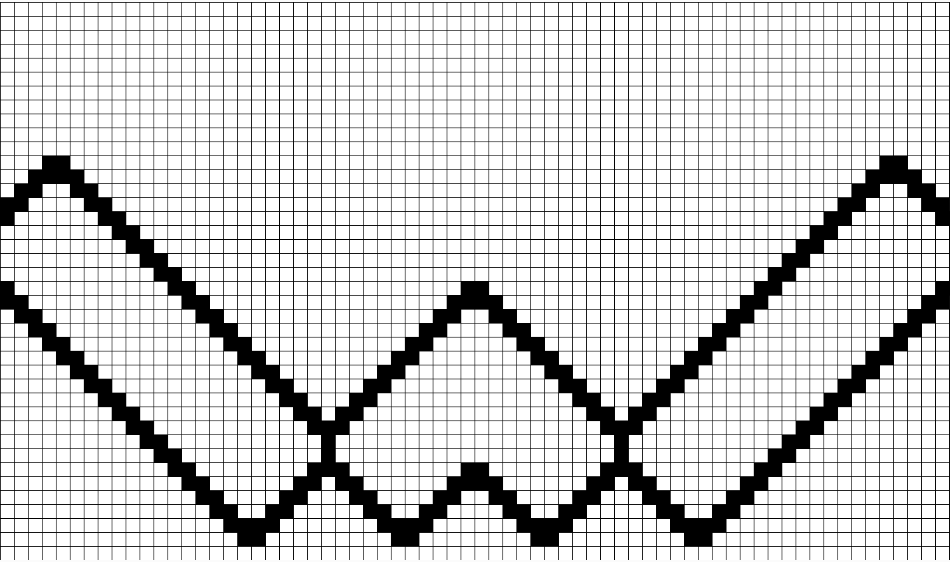

# Mardi

## Le jour après Lundi

## Cellular Automata

### Rendu final

Au final, pour ce projet, j'ai décidé de présenter la version la plus stable que j'ai, 
c'est-à-dire celle qui produit des V et des coeurs.
Voici la liste des règles :

- Si une ligne de trois, le milieu en dessous naît

- Si une cellule seule est vivante au dessus, naître

- Si gauche morte et droite et haut vivant, mourir

- Si droite morte et gauche et haut vivant, mourir

- Si coin gauche supérieur est en vie, mourir

- Si coin supérieur droit est en vie, mourir

- Si gauche, droite et bas en vie, mourir

- Si droite en vie, naître

- Si gauche en vie, naître

Ces règles ont été imaginés dans le but de créer des V.

### Les voies d'explorations

Parmi les pistes d'explorations que j'ai essayé, on peut compter l'intégration de couleur et de morts en plusieurs tours, L'exploration de règles plus ou moins douteuses et de se rapprocher des règles initiales du jeu de la vie.

Mentions honorables : L'apparition d'une fractale, Le balayement de raffraichissement d'une télévision cathodique, la mer "des années 80", des ascenceurs et la nuée d'insectes.
